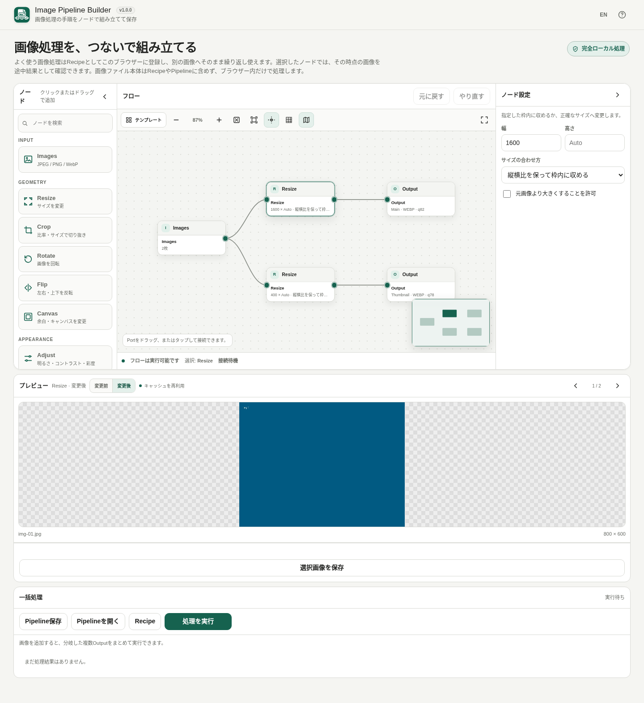

# Image Pipeline Builder / 画像処理パイプライン

[](https://github.com/ttomohisa/htmlapps-image-pipeline-builder/actions/workflows/deploy-pages.yml)
[](LICENSE)
[](https://ttomohisa.github.io/htmlapps-image-pipeline-builder/)

[English README](README.md)

画像処理をノードでつなぎ、同じ処理手順を複数のJPEG / PNG / WebP画像へ繰り返し適用できる、完全ローカル処理の単一HTMLブラウザアプリです。選択した画像を外部サーバーへアップロードせず、Preview・一括処理・エンコード・ZIP生成までブラウザ内で行います。

## 🚀 デモ

### [GitHub PagesでImage Pipeline Builderを開く](https://ttomohisa.github.io/htmlapps-image-pipeline-builder/)

GitHub Pagesから最初のHTMLを読み込んだ後、画像のデコード、Preview、画像処理、Batch、エンコード、Recipe実行、ZIP生成は端末内で処理されます。選択した画像がアプリから外部サーバーへ送信されることはありません。

[](https://ttomohisa.github.io/htmlapps-image-pipeline-builder/)

## 主な機能

- **画像処理を見えるフローとして組み立て** — Resize / Crop / Rotate / Flip / Canvas / Adjust / Grayscale / Blur / Sharpen / Border / Rounded Corners / Text Watermark / OutputをCanvas上で接続できます。
- **1つのPipelineを複数画像へ一括適用** — JPEG / PNG / WebPをまとめて追加し、代表画像1枚でPreviewしながら、全画像を1枚ずつ順番に処理します。
- **Splitノードなしで複数出力へ分岐** — 1つの出力Portから複数branchへ直接接続でき、共通の上流処理は共有して評価します。
- **全件処理前に途中結果を確認** — ノードを選択し、変更前 / 変更後を切り替えてその時点の画像を確認できます。Outputでは代表画像の実エンコードサイズも表示します。
- **Recipeで繰り返し作業を再利用** — 現在のPipelineをブラウザ内へ登録し、保存済みRecipeカードから新しい画像を選んで直接実行するか、Canvasへ反映して編集できます。
- **RecipeとPipeline JSONを役割分離** — Recipeは同じブラウザですぐ使い直すため、Pipeline JSONはバックアップや別環境への移動用です。どちらにも画像ファイル本体は保存しません。
- **出力を安全に整理** — OutputごとにJPEG / PNG / WebP、品質、ファイル名テンプレート、ZIP内フォルダを指定し、個別保存またはZIP保存できます。
- **PC / スマートフォン対応** — PCは「ノード / フロー / ノード設定」の3ペイン、スマホは「フロー / 画像 / ノード / 実行」の下部固定4タブで操作できます。
- **単一HTML・完全ローカル処理** — standalone版は`connect-src 'none'`で実行時通信を禁止し、CDNやクラウド画像APIを使いません。

## すぐに使う

### Webで使う

[デモを開く](https://ttomohisa.github.io/htmlapps-image-pipeline-builder/)だけで利用できます。インストールやアカウント登録は不要です。

### HTMLをダウンロードして使う

1. ReleaseやBuild Artifactから `dist/index.html` をダウンロードします。
2. 最新のChromium系ブラウザで直接開きます。
3. ローカルWebサーバーなしで画像を追加し、Pipelineを実行できます。

`dist/index.self-extract.html` は、同じreadable standalone HTMLを圧縮して内包したself-extract版です。ブラウザ内で展開してアプリを起動します。

### Windowsでstandalone版を生成する

1. このリポジトリをダウンロードまたはクローンします。
2. `build-standalone.bat` を実行します。
3. `dist/index.html` と `dist/index.self-extract.html` が生成・検証されます。
4. 生成したHTMLを任意の場所へコピーして利用できます。

`dependencies.json` にはv1.0.0時点でruntime npmライブラリを登録していません。画像処理ランタイムとZIP writerはこのリポジトリ内で実装し、指定されたNode Editor Coreスナップショットをソースとして同梱しています。

## 使い方

1. **Images**ノードまたはスマホの「画像」画面からJPEG / PNG / WebPを1枚以上追加します。
2. 左のノード一覧から処理ノードを追加します。PCではクリック追加に加え、Canvas上の置きたい場所へドラッグして配置できます。
3. Portを接続して処理順を作ります。1つの出力Portから複数branchへ直接つなげられます。
4. ノードを選び、**変更前 / 変更後**を切り替えて代表画像の途中結果を確認します。
5. 各 **Output** で出力名、JPEG / PNG / WebP、品質、ファイル名テンプレート、必要ならZIP内フォルダを設定します。
6. **処理を実行**で追加画像すべてへPipelineを適用します。1画像で失敗しても残りは処理し、失敗結果は分けて表示します。
7. 成功した画像を個別保存するか、**ZIPを保存**でまとめて保存します。
8. よく使う処理は **Recipe** へ登録します。保存済みRecipeから新しい画像を選び、**このRecipeを使う**で直接処理して成果物を自動ダウンロードするか、**Canvasに反映**して編集できます。
9. バックアップや別環境への移動には **Pipeline保存 / Pipelineを開く** でJSONを利用します。元画像は含まれません。

初期フローは `Images → Resize → Output` です。

### 組み込みテンプレート

テンプレートメニューには、編集可能な開始フローを用意しています。

- **Web画像** — Web向けの最大サイズへ縮小し、WebPで出力
- **メイン画像＋サムネイル** — 1入力から大画像 / サムネイルの2系統へ分岐
- **SNS正方形** — 1:1 Crop → 1080 × 1080 → JPEG
- **透かし入り画像** — Resize → Text Watermark → WebP
- **最小フロー** — `Images → Output` から開始

読み込んだ後は通常のGraphになるため、ノード・接続・設定を自由に変更できます。

### ファイル名テンプレート

Outputのファイル名には次を利用できます。

- `{name}` — 元ファイル名（拡張子を除く）
- `{index}` — 1始まりの画像番号
- `{index:N}` — 0埋めした番号。例: `{index:3}` → `001`
- `{width}` / `{height}` — 最終出力サイズ

同じ保存パスが重なった場合は `-2`, `-3` のように自動回避します。ZIP内フォルダに絶対パスや `..` が含まれる場合は、処理実行前に拒否します。

### キーボード / Canvas操作

| ショートカット / 操作 | 内容 |
| --- | --- |
| `Ctrl` / `⌘` + `Enter` | 現在のPipelineを実行 |
| `Ctrl` / `⌘` + `Z` | 元に戻す |
| `Ctrl` / `⌘` + `Shift` + `Z` | やり直す |
| `Delete` / `Backspace` | 選択したノード / 接続を削除できる場合に削除 |
| `Esc` | 拡大Workspaceやダイアログを閉じる |
| 左パレットからドラッグ | ドロップ位置へノードを追加 |
| Portをドラッグ / タップ | 接続を作成 |

CanvasではZoom、全体を表示、選択を表示、補助線、Grid Snap、MiniMap、複数選択、Copy / Paste / Duplicate、浮かせて拡大も利用できます。

## RecipeとPipeline JSON

RecipeとPipeline JSONは意図的に役割を分けています。

**Recipe**

- 現在のブラウザの保存領域へ登録します。
- 別の画像へ同じ処理をすぐ繰り返す用途です。
- 保存するとEditor上部にRecipeカードが表示されます。
- 元画像や生成画像は保存しません。
- 名前は前後の空白と大文字・小文字を除いて重複できません。別名ならコピーを登録でき、**更新**なら確認後に指定したRecipeを置き換えます。
- **更新**と**削除**は元に戻せません。確認画面のキャンセルで保存済みRecipeをそのまま残せます。
- ブラウザーの保存容量不足などで保存できない場合は、以前のRecipeと入力した名前を残してエラーを表示します。状態を確認して再試行できます。
- Recipeと通常の一括処理は一度に1件ずつ実行します。**中止**しても完了した結果は残り、処理が停止すると再実行できます。

- 現在のCanvasを変えずに保存済みRecipeをバックアップするには、Recipeライブラリで対象の **Pipeline JSONを書き出す** を選びます。ファイル名を編集して書き出してください。保存済み設定のスナップショットを使用し、キャンセル・Esc・背景クリックでは何も書き出しません。危険なファイル名文字を除去し、拡張子を `.image-pipeline.json` に揃えます。

**Pipeline JSON**

- JSONの選び直しや読み込み中のグラフ・画像一覧の変更で、古い読み込みを無効にします。遅れて完了した読み込みが新しい作業を上書きすることはありません。

- ユーザーが明示的にファイルとして保存 / 読み込みします。
- バックアップや別ブラウザ / 別端末へGraphを移す用途です。
- ノード・接続・設定のみを保存します。
- 元画像、Preview snapshot、Batch結果Blob、ZIP bytesは含みません。

## GitHub Pagesで公開する

このリポジトリには、standalone版を検証して`dist`をGitHub Pagesへ公開するWorkflowが含まれています。

1. `htmlapps-image-pipeline-builder` としてGitHubへプッシュします。
2. **Settings → Pages → Build and deployment → Source** で **GitHub Actions** を選択します。
3. `main`へプッシュするか、Actionsから **Deploy standalone app to GitHub Pages** を手動実行します。
4. 成功後、`https://ttomohisa.github.io/htmlapps-image-pipeline-builder/` で公開されます。

デプロイ前に `scripts/check-repository.ps1` が実行され、readable / self-extract両方とmanifestを検証します。

リポジトリ検証にはNode.js 24が必要です（npmパッケージは不要）。ビルド後にCore/Consumerの全テストを実行します。ソース変更時は`dist/index.html`からルートの`image-pipeline-builder.html`も再生成してください。テストでルート、readable、self-extractの内容の一致を確認します。

## 開発とビルド

```text
.
├─ src/
│  ├─ index.template.html             # UI / アプリシェル
│  ├─ core/
│  │  └─ node-editor-core.mjs         # 指定Node Editor Coreスナップショット
│  └─ image-pipeline/
│     └─ image-pipeline.mjs           # 画像固有ランタイム / helper
├─ tests/                              # Core + Consumer回帰テスト
├─ dependencies.json                  # runtime依存宣言（現在は空）
├─ dependencies.lock.json             # 依存lock
├─ app.config.json                    # アプリ / build metadata
├─ build-standalone.bat               # Windows build入口
├─ build-standalone.ps1               # readable standalone生成
├─ scripts/
│  ├─ check-repository.ps1            # 全体検証
│  ├─ verify-standalone.ps1
│  ├─ build-self-extract.ps1
│  └─ verify-self-extract.ps1
└─ dist/
   ├─ index.html
   ├─ index.self-extract.html
   ├─ dependency-manifest.json
   ├─ build-size-report.json
   ├─ self-extract-manifest.json
   └─ .nojekyll
```

JavaScriptテスト:

```bash
npm test
```

Windowsでstandalone版を生成・検証:

```bat
build-standalone.bat
```

PowerShell 7からリポジトリ全体を確認する場合:

```powershell
./scripts/check-repository.ps1
```

生成済み`dist`を直接編集せず、ソースを修正して再ビルドしてください。

## プライバシーと通信防止

画像のdecode、変換、Preview、Batch、encode、Recipe実行、ZIP生成はブラウザ内で行います。

standalone HTMLは `connect-src 'none'` を含むContent Security Policyを使用します。runtime CDN、アクセス解析、テレメトリ、クラウド画像処理APIは使いません。GitHub Pages版では最初のHTML配信は発生しますが、選択した画像や生成結果をアプリから送信しません。

Recipe / 現在のPipeline自動復元でブラウザへ保存するのはGraphと設定だけです。元画像、画像bytes、Preview snapshot、生成Output Blob、ZIP bytesは永続保存しません。

出力画像はブラウザで新しくエンコードします。元画像のEXIF / GPSは意図的にコピーしません。ICC Profileの保持も保証しないため、厳密な印刷用カラーマネジメント用途には向きません。

確認方法は [完全ローカル処理の確認](VERIFY_OFFLINE.ja.md) を参照してください。

## 制限事項

- v1.0.0の入力は静止画JPEG / PNG / WebPです。Animated GIF/WebP、HEIC/HEIF、TIFF、RAW、SVG、PSDは入力できません。
- 出力はJPEG / PNG / WebPです。AVIFはv1.0.0に含まれません。
- Cropは一括処理向けの比率 / サイズ / Anchor方式で、画像ごとの自由なドラッグCropではありません。
- Text WatermarkはOS標準フォントを使用し、外部Webフォントは読み込みません。
- JPEGでは透明部分を指定背景色へflattenして出力します。
- 元画像のEXIF / GPSは出力へ引き継ぎません。
- 埋め込みICC Profileの保持は保証しません。
- 高解像度画像、大量画像、多数のbranch、高解像度Preview / Outputでは端末メモリを多く使用する場合があります。ピークメモリを抑えるためBatchは1画像ずつ逐次処理します。
- 中止は主要処理ステージの間で確認します。すでに開始済みの同期Canvas処理1回の途中を強制停止することはできません。
- Recipe / 現在のPipeline保存はブラウザの保存領域に依存し、サイトデータ削除などで消える場合があります。持ち運び用バックアップにはPipeline JSONを使用してください。
- ブラウザ / 端末のメモリ上限は環境ごとに異なるため、特定の画像枚数やピクセル数をすべての端末で保証しません。

## 使用ライブラリ / 依存

v1.0.0では `dependencies.json` に第三者npm runtimeライブラリを登録していません。

Browser Kitty / ttomohisaのNode Editor Coreスナップショットを同じMITライセンスのソースとして同梱しています。画像decode / encode、Canvas処理、Blob / File、ダウンロードはブラウザAPIを利用し、ZIP writerはプロジェクト内で実装しています。

詳細は [THIRD_PARTY_NOTICES.md](THIRD_PARTY_NOTICES.md) を参照してください。

## コントリビューション

バグ報告や機能提案はGitHub Issuesからお願いします。開発への参加方法は [CONTRIBUTING.md](CONTRIBUTING.md) を確認してください。

## ライセンス

Copyright © 2026 ttomohisa

このプロジェクトは [MIT License](LICENSE) で公開されています。
